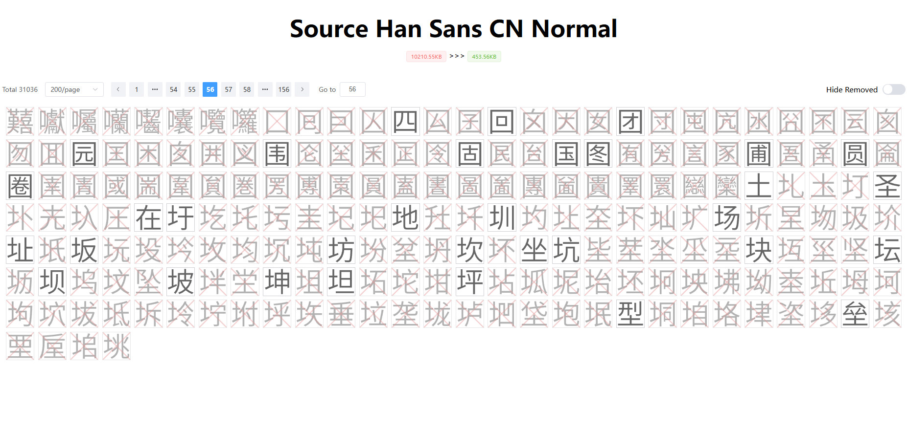

# vite-plugin-fontiny

[![npm version][npm-version-src]][npm-version-href]
[![npm downloads][npm-downloads-src]][npm-downloads-href]
[![bundle][bundle-src]][bundle-href]

[简体中文](README.md) | English

**Fontiny = Font + Tiny**

A tool for removing unused Chinese characters from font files.

Currently only available for ttf format fonts, more will be supported in the future.

## Roadmap

 - [x] Generate an html page showing which Chinese characters have been retained and which have been eliminated.
 - [ ] User-defined match characters rules.
 - [ ] Supports more types of font files, like otf, woff, woff2, eot.

## Installation

```shell
npm i -D vite-plugin-fontiny
```

## Usage

```ts
// vite.config.ts
import Fontiny from 'vite-plugin-fontiny'

export default {
  plugins: [
    Fontiny({
      // options
      fontFileNames: ['Example-Font-Regular.ttf']
    }),
  ],
}
```

```css
@font-face {
  font-family: "Example Font";
  src: url("./assets/Example-Font-Regular.ttf") format("truetype")
}
```

Fontiny doesn't care about the specific path where the font file is located, nor does it care about in which css file it is used. As long as the font is used in the css and is in the `fontFileNames` array, it will be processed.

It will search for Chinese characters in your code, and remove the unused characters from the font file to reduce the size of the font file.

```
ZCOOLKuaiLe-Regular.ttf [3,188 KB]

↓ ↓ ↓ ↓ ↓ ↓

Search for Chinese characters in code:

[ "只", "有", "在", "代", "码", "中", "出", "现", "过", "的", "中", "文", "字", "符", "会", "在", "字", "体", "文", "件", "中", "保", "留", "在", "输", "入", "框", "中", "输", "入", "新", "文", "字", "查", "看", "效", "果" ]

↓ ↓ ↓ ↓ ↓ ↓

Remove unused characters from the font file.

↓ ↓ ↓ ↓ ↓ ↓

ZCOOLKuaiLe-Regular-Cx0eLuEs.ttf [24 KB]
```

The actual compression effect is affected by the number of Chinese characters used in the code.

## Options

### `fontFileNames`

Which fonts you want to be compressed.

```ts
type FontFileNames = string[]
```

required: `true`

#### `include`

Included range of scanned codes.

```ts
type Include = ReadonlyArray<string | RegExp> | string | RegExp | null | undefined
```

required: `false` default: `undefined`

### `exclude`

Excluded range of scanned codes.

```ts
type Exclude = ReadonlyArray<string | RegExp> | string | RegExp | null | undefined
```

required: `false` default: `undefined`

### `visualizer`

If true, a visual HTML will be generated in the project root directory.

After running `vite build`, the visualizer client will be generated under .vite-fontiny, where you can use `npx serve .vite-inspect` to check the result.

```ts
type Visualizer = boolean
```

required: `false` default: `false`



## Credits

Thanks to [fonteditor-core](https://github.com/kekee000/fonteditor-core), [fontmin](https://github.com/ecomfe/fontmin) and [@antfu](https://github.com/antfu)

<!-- Badges -->

[npm-version-src]: https://img.shields.io/npm/v/vite-plugin-fontiny?style=flat&colorA=080f12&colorB=1fa669
[npm-version-href]: https://npmjs.com/package/vite-plugin-fontiny
[npm-downloads-src]: https://img.shields.io/npm/dm/vite-plugin-fontiny?style=flat&colorA=080f12&colorB=1fa669
[npm-downloads-href]: https://npmjs.com/package/vite-plugin-fontiny
[bundle-src]: https://img.shields.io/bundlephobia/minzip/vite-plugin-fontiny?style=flat&colorA=080f12&colorB=1fa669&label=minzip
[bundle-href]: https://bundlephobia.com/result?p=vite-plugin-fontiny
